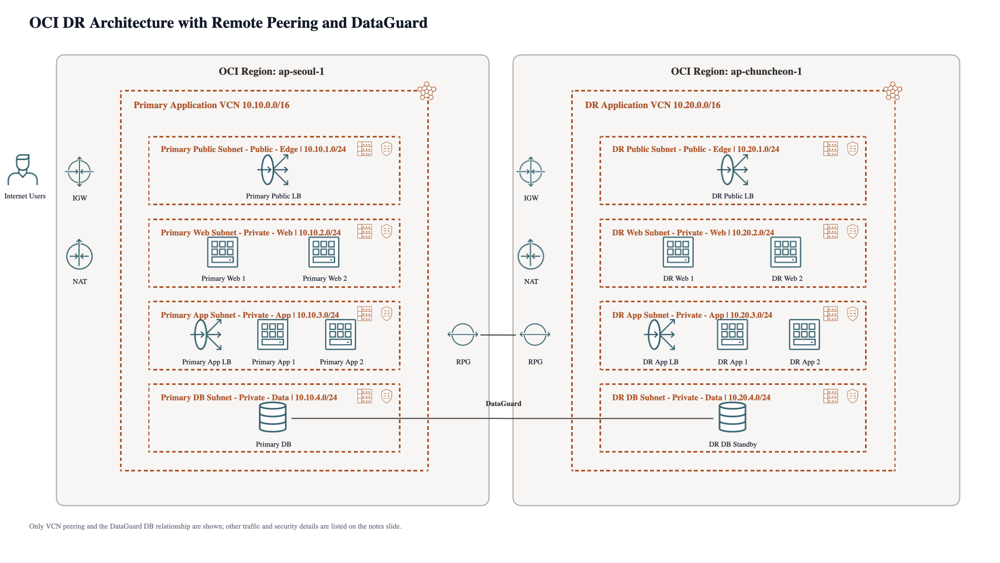
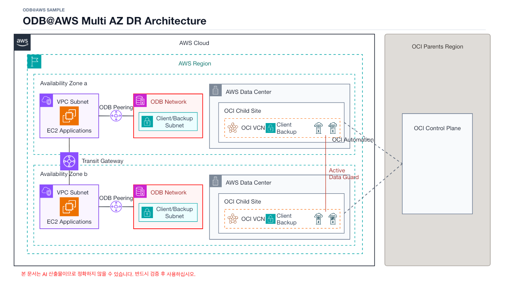

# oci-archgen-skills

Skills for generating editable Oracle Cloud Infrastructure (OCI) architecture PowerPoint decks with Codex.

Repository / package name: `oci-archgen-skills`

Codex skill name to invoke: `oci-archgen-pptx`

GitHub Pages preview: https://cdh3063.github.io/oci-archgen-skills/

Patch notes: https://cdh3063.github.io/oci-archgen-skills/patch-notes.html





## Included Skills

### `oci-archgen-pptx`

Creates editable `.pptx` OCI and Oracle Database@AWS architecture diagrams from natural-language architecture requests or structured JSON models.

Key capabilities:

- Region > VCN > subnet > service layout.
- OCI service architecture coverage backed by 160+ mapped OCI service icons.
- OCI-style containers, subnet badges, gateway placement, and OSN handling.
- Public/private LoadBalancer, redundant Web/App tiers, local or remote VCN peering, DataGuard, and service-gateway patterns.
- Oracle Database@AWS topology guidance, including AWS Region/AZ placement, VPC, Transit Gateway, ODB Peering, OCI Child Site, OCI Parents Region, and Active Data Guard diagram patterns.
- Architecture-specific best-practice, operational, and implementation checkpoint slides, including DR runbook, RTO/RPO, failover/failback, security, monitoring, backup, and ownership considerations.
- Editable PowerPoint output generated with deterministic OOXML.
- Model-aware validation for layout, required text coverage, and package structure.

## Install

Prerequisites:

- Git
- Bash
- Python 3.9 or later

Install all skills globally for Codex:

```bash
git clone https://github.com/cdh3063/oci-archgen-skills.git
cd oci-archgen-skills
./install.sh --all --tool codex
```

Install only `oci-archgen-pptx`:

```bash
./install.sh oci-archgen-pptx --tool codex
```

Other install targets:

```bash
./install.sh oci-archgen-pptx --tool codex-local   # .codex/skills/<skill>
./install.sh oci-archgen-pptx --tool codex-repo    # .agents/skills/<skill>
./install.sh oci-archgen-pptx --tool claude        # ~/.claude/skills/<skill>
```

## Update Installed Skills

After pulling a repository patch, reinstall the skill into the Codex skill directory used by your runtime:

```bash
cd ~/oci-archgen-skills
git pull --ff-only origin main
./install.sh oci-archgen-pptx --tool codex
```

Use `./install.sh --all --tool codex` to refresh every skill in the repo.

Use `--tool codex-local` from a target project directory to install into that project's `.codex/skills`, or `--tool codex-repo` to install into `.agents/skills`.

Restart or reload the Codex session when updated `SKILL.md` instructions need to be re-discovered.

## Usage

After installation, ask Codex to use the skill:

```text
Use $oci-archgen-pptx to create an editable OCI HA architecture PPTX with WAF,
redundant Web/App servers, public LoadBalancer, private App LoadBalancer,
and DataGuard.
```

Oracle Database@AWS requests are also supported:

```text
Use $oci-archgen-pptx to create an editable ODB@AWS architecture PPTX where
ODB@AWS is deployed in multiple AWS Availability Zones, each VPC connects
through Transit Gateway, and Exadata databases replicate with Active Data Guard.
```

You can also render from a structured model:

```bash
python3 ~/.codex/skills/oci-archgen-pptx/scripts/generate_pptx.py \
  examples/dr-remote-peering-3tier-dg-model.json \
  /tmp/dr-remote-peering-3tier-dg.pptx

python3 ~/.codex/skills/oci-archgen-pptx/scripts/validate_pptx.py \
  /tmp/dr-remote-peering-3tier-dg.pptx \
  --model examples/dr-remote-peering-3tier-dg-model.json
```

## Examples

- `examples/dr-remote-peering-3tier-dg-model.json`
- `examples/dr-remote-peering-3tier-dg.pptx`
- `examples/ha-waf-dataguard-model.json`
- `examples/ha-waf-dataguard.pptx`

## OCI Icons

This repository includes OCI icon assets used by the `oci-archgen-pptx` skill, including `assets/OCI_Icons.pptx` and extracted icon assets.

Oracle Cloud Infrastructure icons, marks, and related brand assets remain the property of Oracle and are subject to Oracle's applicable brand and usage guidelines. This project is not affiliated with or endorsed by Oracle.

## Development

Install development dependencies:

```bash
python3 -m pip install -r requirements-dev.txt
```

Normal PPTX generation and model validation use only the Python standard library. The development dependency is used for Codex skill metadata validation.

Validate the skill metadata when the Codex `skill-creator` validator is available:

```bash
python3 ~/.codex/skills/.system/skill-creator/scripts/quick_validate.py \
  skills/oci-archgen-pptx
```

Run the renderer and validator against the included example:

```bash
python3 skills/oci-archgen-pptx/scripts/generate_pptx.py \
  examples/ha-waf-dataguard-model.json \
  /tmp/ha-waf-dataguard.pptx

python3 skills/oci-archgen-pptx/scripts/validate_pptx.py \
  /tmp/ha-waf-dataguard.pptx \
  --model examples/ha-waf-dataguard-model.json
```

Run fixture validation:

```bash
for model in skills/oci-archgen-pptx/fixtures/validation/*-model.json; do
  base="$(basename "$model" .json)"
  out="/tmp/${base}.pptx"
  python3 skills/oci-archgen-pptx/scripts/generate_pptx.py "$model" "$out"
  python3 skills/oci-archgen-pptx/scripts/validate_pptx.py "$out" --model "$model"
done
```

Before pushing behavior changes:

- Update `docs/patch-notes.html`.
- Regenerate and validate any affected example or user-facing PPTX output.
- Reinstall or sync the changed skill into the runtime directory used for verification, such as `~/.codex/skills`.

## License

Code in this repository is released under the MIT License. OCI icons and Oracle brand assets are not covered by the MIT License; see `NOTICE.md`.
